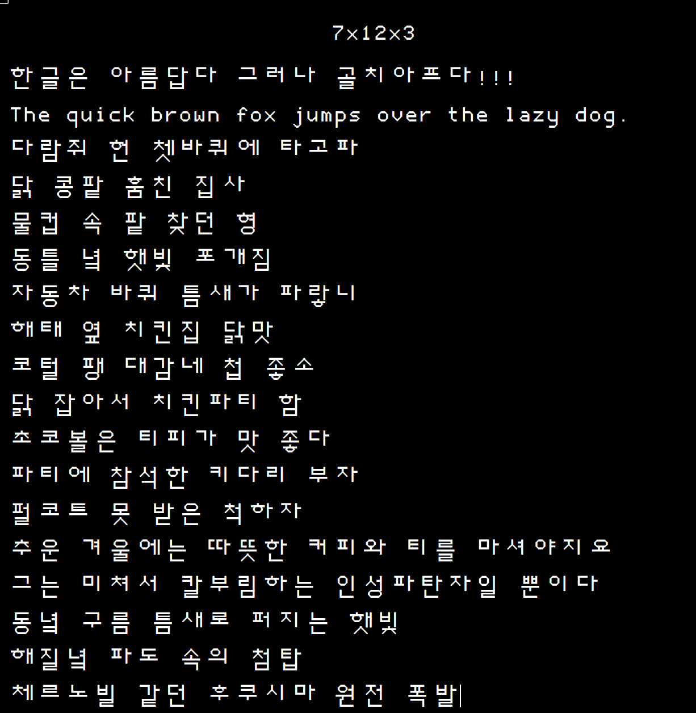

7x12-fonts
==========

애플2시리즈의 고해상도 그래픽 모드 280x192를 최대한 활용하기 위해 만튼 비트맵 글꼴을 트루타입으로 변환.

## 영문 7x12, 한글 14x12

### 굵은체

## 영문 21x36, 한글 42x36

작은 크기에서 계단 현상을 줄이면서 느낌을 살리기 위해 7x12 글꼴을 3배 확대해서 21x36에 맞춰 수정

## 조합 규칙

3x1x1

- 초성1: 세로 중성(ㅏ,ㅐ,ㅓ,ㅔ,ㅕ,ㅖ,ㅣ)
- 초성2: 가로모음(ㅗ,ㅛ,ㅜ,ㅠ)
- 초성3: 복모음(ㅘ,ㅙ,ㅚ,ㅝ,ㅞ,ㅟ,ㅢ)

---
May the **SOURCE** be with you...
